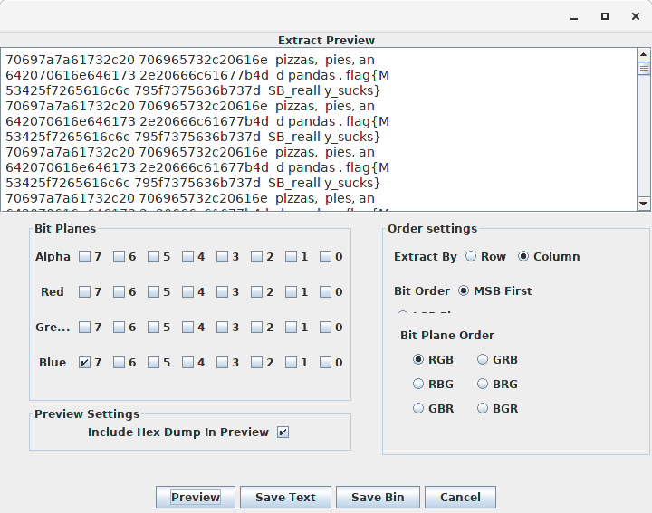
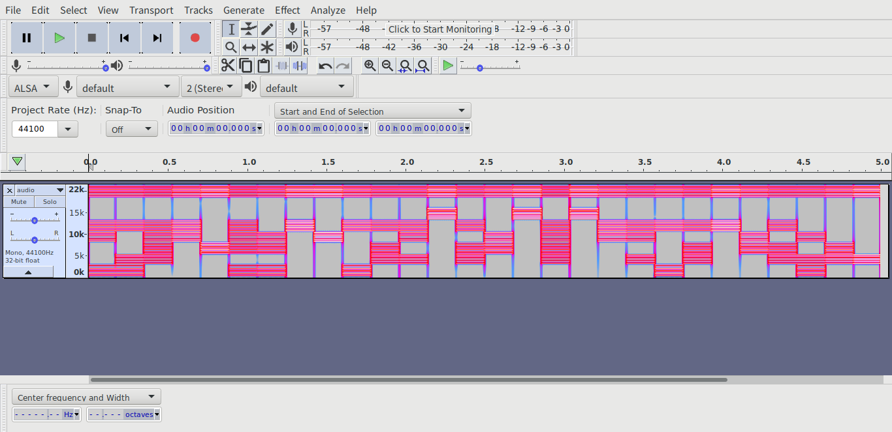
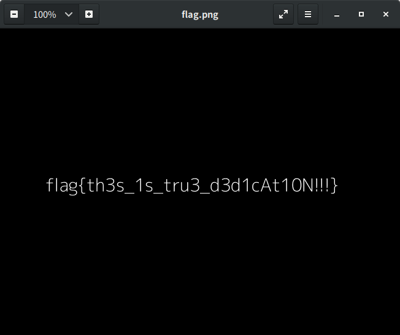
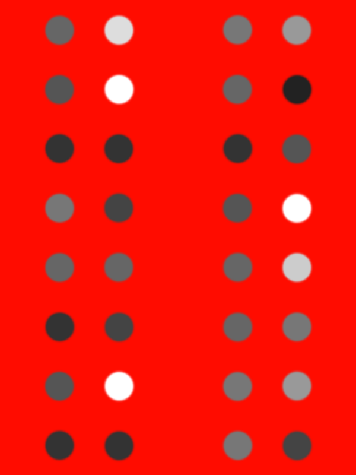

# RedpwnCTF-2019 writeup
### Our team e.g. solved 16 tasks, but this writeup will contain only the most interesting of them

## 1. msb (forensics, 50)

It's not LSB, its MSB!
Red is Random, Green is Garbage, Blue is Boring.
Hint: Only one channel is correct. Also, I like doing things top down.


### Solution:

MSB (Most Significant Bit) and LSB (Least Significant Bit) are steganography technics (https://en.wikipedia.org/wiki/Bit_numbering)

I simply used Stegsolve to extract data from it. After a few attempts I got the output:



And the flag is: ```flag{MSB_really_sucks}```

## 2. Easy Encoding (forensics, 383)

Brownie was browsing Discord when a notification popped up. Included was a wav file and a promise of a $100 prize. Desperate for funds towards redpwn's upcoming ctf, he tried solving it but his attempts were of no avail. Can you help redpwn pay off its debt?


### Solution:

Playing the attached file and exploring metadata doesn't give any useful information. Lets open audio.wav via Audacity and look at its spectrogram:



Here we see that the spectrogram is divided into parts. In every part we can distinguish 8 levels. If consider them as bits, then every spectrogram part is a byte. Lets try to assemble binary code from the spectrogram reading each part from top to bottom and considering the spectral lines as 0 and the gaps as 1 (I just guessed it...): ```01100110 01101100 01100001 01100111 01111011 01100010 01110010 01101111 01110111 01101110 01101001 01100101 01011111 01101001 01110011 01011111 01100001 01011111 01100111 01100101 01101110 01101001 01101111 01110011 01101001 01110100 01111001 01111101```

Converted to ASCII: ```flag{brownie_is_a_geniosity}```

## 3. Dedication (forensics, 388)

Only for the dedicated.


### Solution:

We have a file with values of pixels and password-protected archive which contains the next 2 files. To get the password, we have to assemble an image, then somehow read the password from the image (I used pytesseract library for it). Here is a script I used for it (works with python3, but need to change prints):
```
from PIL import Image
import pytesseract, os

def getFile(extension):
    for item in os.listdir(os.getcwd()):
        if extension in item:
            return item

def getDir():
    for item in os.listdir(os.getcwd()):
        if os.path.isdir(item):
            return item

def prepareImg(fileName):
    with open(fileName, 'r') as file:
        data = file.read()
    tmp = data.split('\n')[:-1]
    rows = []
    for item in tmp:
        rows.append(item.split(' ')[:-1])
    height = len(tmp)
    width = len(rows[0])
    pixels = []
    for row in rows:
        t = []
        for pix_str in row:
            p = pix_str[1:-1]
            t.append(tuple(int(s) for s in p.split(',')))
        pixels.append(t)
    print 'Height: ', len(pixels), ' width: ', len(pixels[0])
    im = Image.new('RGB', (height, width))
    for i in range(0, height):
        for j in range(0, width):
            im.putpixel((i,j), (pixels[i][j][0], pixels[i][j][1], pixels[i][j][2]))
    im.save('output.png')
    print 'Output image saved'

def extractPasswd():
    passwd = str(pytesseract.image_to_string(Image.open("output.png"))).lower()
    print 'Extracted password: ', passwd
    usr_passwd = raw_input("Change >>> ")
    if usr_passwd != "":
        passwd = usr_passwd
    return passwd

while True:
    fileName = getFile(".png")
    print 'Handling image:  ', fileName
    prepareImg(fileName)
    print 'Handling output image with pytesseract'
    passwd = extractPasswd()
    z = getFile(".zip")
    print 'Extracting zip archive: ', z
    os.system("unzip -P " + passwd + " " + z)
    nextDir = getDir()
    # os.system("cp script.py " + nextDir)
    print 'Going to the next dir: ', nextDir
    os.chdir(nextDir)
    print 'Directory changed'
```
Sometimes pytesseract failed and recognized short passwords incorrectly (interesting note: pytesseract correctly extracted long words like "unrecognizable", "subdirectional", "enterpreneurship" in almost 100% of cases), after a few failes I added an ability to edit extracted password. It was very tedious challenge. Finally we got the flag:



## 4. Redpwn Gets Bamboozled (forensics, 428)

RedpwnCTF finally did it: they made the perfect flag. Unfortunately, right before they performed their typical encryption of military-grade ROT156, they accidentally put it through an unnecessarily convoluted encoding scheme. Of course, while attempting to decode it, they ended up deleting the program and any remaining traces! Now, they have forgotten the flag with no way to recover it. It is up to you to get back RedpwnCTF's Magnum Opus and save redpwn. Heck, we'll even let you keep it. (Enclose flag{} around the flag.)


### Solution:

There is a file attached to the task: data.txt, which looks like:
```
600 800
(255 12 0), (255 12 0), (255 12 0), (255 12 0), (255 12 0), (255 12 0)...
```
As you can see, the first line contains two numbers 600 and 800, then we see a chain of tuples. Obviously, 600 and 800 are width and height, and each of the tuple represents a pixel as (R, G, B). Looks pretty easy! Let's write a python script to build an image from the given data (maybe this one is not quite effective, but hey, it's not ACM ICPC :) ):
```
from PIL import Image
with open('data.txt', 'r') as file:
    data = file.read()
width = 600
height = 800
#There is a little hack here :)
#I simply omit the first 8 characters of data.txt, because I already know the image size
data = data[8:len(data)].split(', ')
for i in range(0,len(data)):
    data[i] = data[i][1:len(data[i])-1].split(' ')
im = Image.new('RGB',(width, height))
for j in range(0,height):
    for i in range(0,width):
        im.putpixel((i,j), (int(data[j*width + i][0]), int(data[j*width + i][1]), int(data[j*width + i][2])))
im.save("output.png")
```
Now we have an output image:



There are gray circles of different shades on this image. If open the image in any image editor (e.g. GIMP) and look at the codes of the colors of circles one by one we can see: 666666, dddddd, 777777, 999999... It gives us the hex code: ```6d 79 5f 62 33 35 74 5f 66 6c 34 67 5f 79 33 74```

Convert it to ascii, and the flag is: ```my_b35t_fl4g_y3t```
